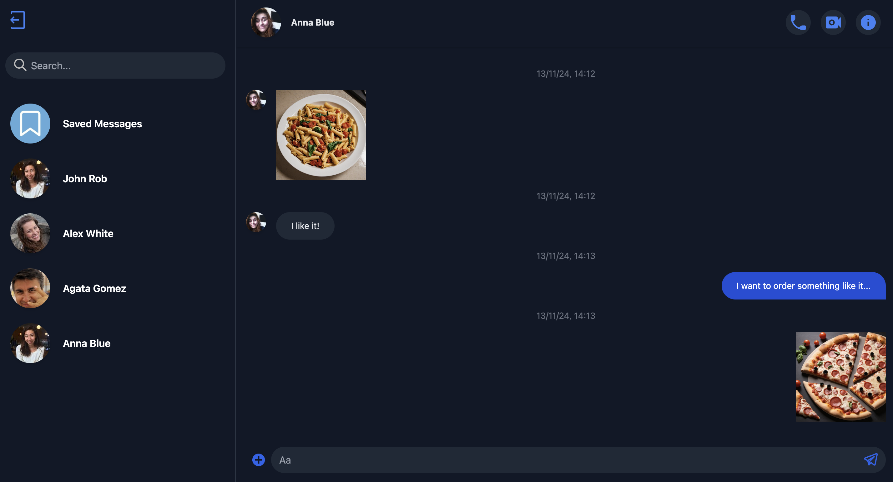

# Messenger
Node.js, Express, PostgreSQL, Socket.io, React, TypeScript 

## Contents
* [Main Information](#📜-Main-Information)
* [Stack](#Stack)
* [Installation and Usage](#Installation-and-Usage)
* [Examples](#Examples)

____

## 📜 Main Information

Using this messenger, you can create your account and start chatting with other people.

1. **Registration and Login.** Here you have to write your username, email and password.
    With the correct data introduced by you, you will be redirected to the chat page where you
    can write your friends.
2. **Messenger** Here you will see a list of your friends. You can select one of them and 
   start chatting with them. Additionally, you can send images, and edit or delete your 
   messages. You can also use the search bar to find your friend by username.

____

## Stack

✅ HTML (JSX), TailwindCSS

✅ TypeScript

✅ React

✅ Node.js

✅ Express

✅ Socket.io

✅ ESLint

✅ Docker

____

## Installation and Usage

The project consists of the two parts (server and client).

**Installation:**

* Clone the repository: git clone https://github.com/reyand8/Messenger.git

**Usage:**

* Build and start the containers using Docker Compose: docker-compose up

____

## Examples

____
____

### Login

____
____

### Registration

____
____

### Chat

____
____

### Search bar

____
____

### Edit or delete

